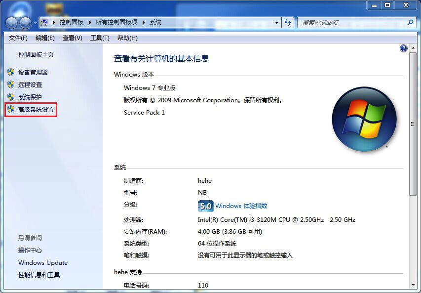
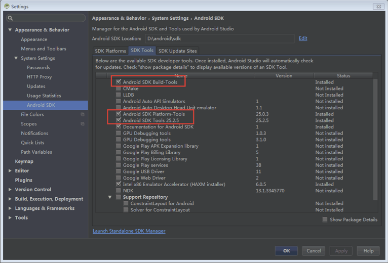
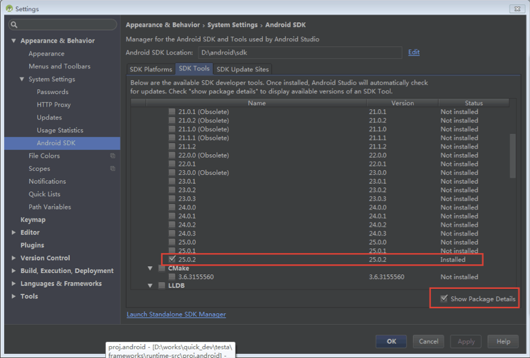

# Android 项目的编译与打包

从 Quick-Cocos2dx-Community 3.6.4 开始，proj.android 模版工程修改为Android Studio，放弃对ADT的支持，移除了AnySDK的集成。apk的生成分2个部分进行。

## Build Native

proj.android 下新引入 build_native.py 脚本，去掉了之前的`.sh, .bat`等与平台相关的编译脚本。你需要安装**Python 2.x**：最新的 Python 2.7 是 Mac 系统标配；如果你使用window开发，建议下载 Python 2.7 的 32位安装包，这里有利于与 vim 的 python 插件等结合使用。

在运行 build_native.py 脚本之前，需要先安装 Android NDK，NDK 版本推荐 r10d。

NDK的安装就是一个解压过程，之后你需要设置一下系统Path环境变量，让命令行能直接找到`ndk-build`命令。

### Mac NDK 环境变量设置

在`~/.bash_profile`文件中加入下面代码：

```
PATH=/usr/local/bin:$PATH:/Users/u0u0/bin/android-ndk-r10d
```

> 请理解shell的工作原理，并灵活修改path变量。

最后运行下面的命令刷新shell的path：

```
$source ~/.bash_profile
```

### Windows NDK 环境变量设置

右键"计算机"，选择弹出菜单中的"属性"，然后在"控制面板主页"中点击"高级系统设置"。如下图所示：



然后点击 "系统属性" => "高级" => "环境变量"，如下图所示：


在"系统变量"的 Path 变量的尾部添加以下字段：

```
D:\u0u0\android-ndk-r10d
```

### 运行 build_native.py 脚本编译 native 代码

环境变量只需第一次设置，再确保引擎的`setup.sh`或`setup.bat`正确运行后，你就可以直接运行 build_native.py 来编译 native 代码了。

build_native.py 有几个可选参数，如下：

```
NAME
    build_native --

SYNOPSIS
    build_native [-h] [-r] [-c]

    -h 输出帮助信息
    -r 编译release版本
    -c 清理编译环境
```

build_native.py 在编译成功后，会自动拷贝 res , src 到assert目录，每当这两个文件夹下的数据有改动的时候，你都应该再次运行 build_native.py 脚本。别担心，native代码不会再次编译，整个过程很快就会完成。

## so文件体积的优化

Quick 对 Android 的 Native 编译进行了模块化设置，可以根据游戏实际用到的功能进行裁剪，从而达到减少包体积的目的。

打开项目下的`frameworks/runtime-src/proj.android/libcocos2dx/jni/Application.mk`文件，找到如下的代码片段：

```
CC_USE_CURL := 1       # 1使用curl的http，0使用Java http
CC_USE_CCSTUDIO := 1   # CocoStudio runtime
CC_USE_CCBUILDER := 1  # CocosBuider runtime
CC_USE_SPINE := 1      # Spine runtime
CC_USE_PHYSICS := 1    # Chipmunk库
CC_USE_TIFF := 1       # TIFF库
CC_USE_WEBP := 1       # webp库
CC_USE_JPEG := 1       # jpeg 库
CC_USE_3D := 1         # Cocos 3D 支持
CC_USE_SQLITE := 1     # Sqlite 支持
CC_USE_UNQLITE := 1    # UnQLite 支持
CC_USE_PROTOBUF := 1   # Google protocol buffers 数据协议
CC_USE_SPROTO := 1     # 云风的 Sproto 数据协议
```

后面的备注已说明模块的作用，如需关掉，只需要把 1 改为 0，例如关闭 Sproto 支持：

```
CC_USE_SPROTO := 0
```

修改完毕，再次运行`build_native.py`编译so库。

## Android Studio 打包

Android Studio 是 Google 官方为 Android 提供的集成开发环境，它取代了原先的 ADT 开发套件。你可以在 https://developer.android.google.cn/studio/index.html 获取到最新的 Android Studio 安装包。

### Android Studio 的安装与设置

Android Studio 的安装很简单，安装完成还需进行 SDK 和 build tool 的下载。选择菜单 File => settings => Appearance & Behavior => System Settings => Android SDK，进入 Android SDK 设置界面，进行如下设置：

（1）SDK Platforms：安装 Android 2.3.3 (Gingerbread) 或以上版本，如下图所示。


（2）SDK Tools：安装 Android SDK Build-Tools 最新版本，安装Android SDK Platform-Tools，安装Android SDK Tools 最新版本，如下图所示。



其中版本选择可以通过右下角的“Show package Details”展开选项进行选择，如下图所示。



Android SDK 设置完后，会自动联网下载安装包。待所有安装包安装完毕，就可以进行 Cocos2d-Lua 的项目导入了。

### Cocos2d-Lua 项目导入与编译

运行 Android Studio 在启动界面选择“Open an existing Android Studio project”，在弹出的文件夹选择器中选择 Cocos2d-Lua 项目目录下的 proj.android 文件夹，单机“OK”开始导入项目。在导入项目过程中，可能需要联网下载 Gradle，请耐心等待项目导入完成。

工程导入后，需手动修正 proj.android/app/build.gradle 和 proj.android/libcocos2dx/build.gradle 中的 buildToolsVersion 为自己安装的 Android SDK Build-Tools 版本，如下所示：

```
apply plugin: 'com.android.library'
android {
    compileSdkVersion 23
    buildToolsVersion '25.0.2'
```

> Android SDK Build-Tools 版本号查看方法参考前面。

一切准备就绪，编译 apk 就很简单了。选择菜单 build => generate signed apk，选择 module，单机下一步；选择已准备的签名文件，填入签名的密钥，选择应用昵称，输入密钥，单机下一步；选择导出目录，完成 apk 生成。